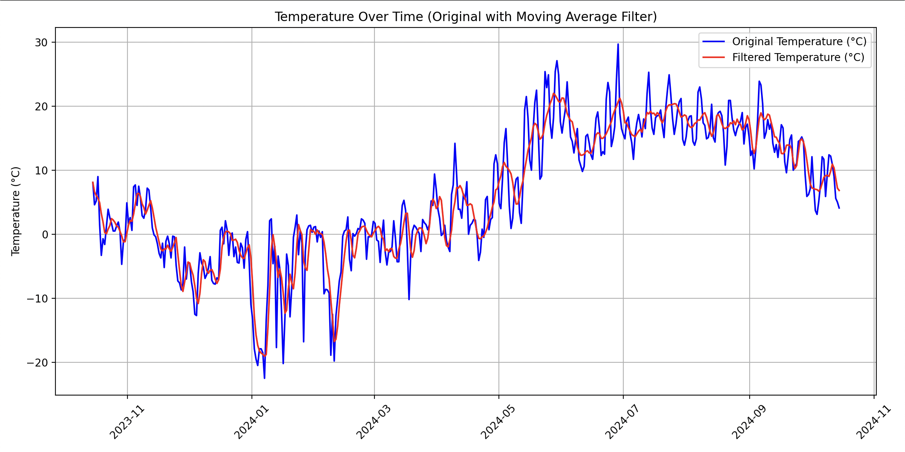
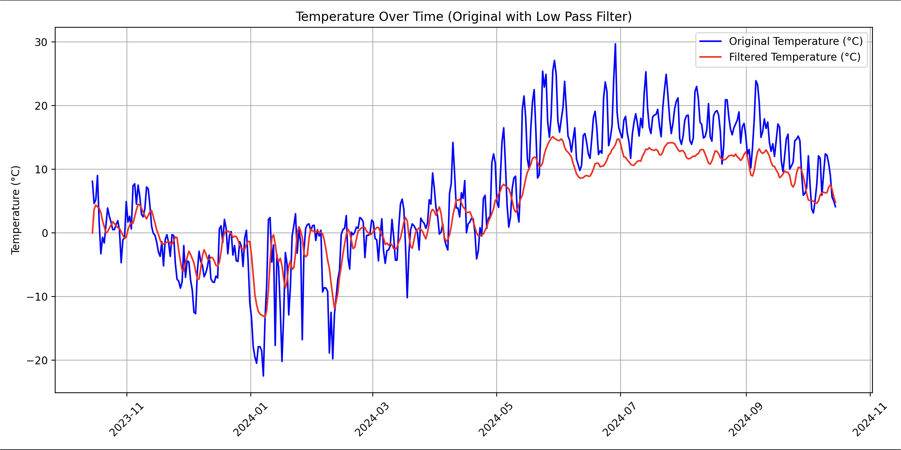

# Moving Average Filter

## Table of Contents

- [Project Overview](#project-overview)
- [Directory Structure](#directory-structure)
- [Source Files](#source-files)
- [Getting Started](#getting-started)
- [Building the Project](#building-the-project)
- [Using the Program](#using-the-program)
- [Plotting the Data](#plotting-the-data)
- [Cleaning Up](#cleaning-up)
- [Error Handling](#error-handling)

## Project Overview

This project features **Moving Average** and **Low-Pass Filters** to efficiently process temperature data stored in CSV files. The program retrieves original temperature readings for a specified location, applies smoothing techniques through either the moving average or low-pass filter, and saves the filtered results in a new CSV file.

The project maintains a modular structure, with separate folders for source code (src), headers (include), and data files (data), keeping the project organized and easy to navigate.

Additionally, Python scripts are included to fetch the latest temperature data and create visual plots of both the original and filtered data, allowing for easy trend analysis over time.

## Directory Structure

```
lab_2/
│
├── data/                   # Contains input and output CSV files
│ ├── temperature_data.csv  # Input data file
│ └── filtered_data.csv     # Output data file
│
├── images/                 # Images files
│
├── include/                # Header files
│ ├── io.h                  # Functions for reading and writing CSV files
│ ├── filter.h              # Function declarations for different filter types
│ └── error_codes.h         # Error codes for the program
│
├── scripts/                # Python scripts for data processing and plotting
│ ├── fetch_data.py         # Script to fetch data for the CSV file
│ └── plot_data.py          # Script to plot data from CSV files
│
├── src/                    # Source files
│ ├── main.c                # Main program logic
│ ├── filter.c              # Function to select and apply specified filter
│ ├── ma_filter.c           # Moving average filter function
│ ├── low_pass_filter.c     # Low pass filter function
│ └── io.c                  # Input/Output functions for file handling
│
├── CMakeLists.txt          # Build configuration file
├── readme.md               # Lab overview and instructions
├── requirements.txt        # Python dependencies for scripts
└── solution.md             # Project documentation
```

## Source Files

### main.c

This file contains the program’s entry point. It manages the input and output filenames, reads temperature data from a CSV file, applies either the moving average or low-pass filter based on user selection, and writes the filtered data to a new CSV file.

### filter.c

This file implements the `apply_filter` function, which applies either a moving average or a low-pass filter to an array of input data based on the specified FilterType.

### io.c

This file contains the functions for reading from and writing to CSV files. The `read_csv` function handles reading temperature data and timestamps, while the `write_csv` function writes the filtered results to a new CSV file. These functions are declared in `io.h`.

### filter.h

This header file declares various filtering functions and constants that users can configure for data processing:

```c
#ifndef FILTER_H
#define FILTER_H

#define MAX_SAMPLES 9000      // Maximum number of input samples
#define TAPS 63               // Default number of taps for the moving average filter
#define LOW_FILTER_TAP_NUM 31 // Number of filter taps for the low-pass filter

// Enumeration for different filter types
typedef enum
{
    MOVING_AVERAGE,          // Moving average filter
    LOW_PASS                 // Low-pass filter
} FilterType;

// Function declarations
int apply_filter(float *input, float *output, int num_samples, FilterType filter_type);
int moving_average_filter(float *input, float *output, int num_samples, int taps);
int low_pass_filter(float *input, float *output, int num_samples, int moving_average_taps);

#endif
```

FilterType: Specifies the filter type (MOVING_AVERAGE or LOW_PASS) for use with apply_filter.

Users can configure the MAX_SAMPLES, TAPS, and LOW_FILTER_TAP_NUM constants to adjust the maximum number of samples processed, the default moving average window size, and the low pass filter tap count, respectively.

### io.h

The io.h header file declares the functions used for reading and writing CSV files.

### error_codes.h

This file defines error codes used by the program to indicate specific issues or problems during execution. Using these codes allows for more precise error reporting, which improves the debugging process.

## Getting Started

### Prerequisites

Before running the main program, ensure that you have Python installed on your system. You can check your Python version by running the following command:

```bash
python --version
```

Additionally, you need to have CMake installed on your system for building the project. You can download CMake from the [official website](https://cmake.org/download/). After installation, you can verify that it’s correctly installed by running:

```bash
cmake --version
```

### Navigate to the project root directory:

```bash
cd lab_2
```

### Install Required Dependencies

The project has a `requirements.txt` file that lists all necessary dependencies. It's a good practice to use a virtual environment to manage your Python dependencies. You can create and activate a virtual environment using the following commands:

1. **Create a virtual environment** (you can name it `.venv` or any name you prefer):

   ```bash
   python -m venv .venv
   ```

2. **Activate the virtual environment**:

   - On macOS and Linux:

     ```bash
     source .venv/bin/activate
     ```

   - On Windows:

     ```bash
     .venv\Scripts\activate
     ```

Once the virtual environment is activated, you can install the required dependencies using the following command:

```bash
pip install -r requirements.txt
```

## Building the Project

**Ensure CMake is installed on your system.**

**Create a build directory and navigate into it:**

```bash
mkdir build && cd build
```

**Run CMake to configure the project:**

```bash
cmake ..
```

**Compile the project:**

```bash
make
```

## Using the Program

The main program reads temperature data from `temperature_data.csv`, applies a `filter`, and writes the filtered data to `filtered_data.csv`.

### Fetch Current Data

To get the latest temperature readings, you need to run the following Python script from the root folder of the project (e.g., `lab_2`):

```bash
python scripts/fetch_data.py
```

This script fetches current temperature data from an online weather API for a specified location. It generates or updates a CSV file named `temperature_data.csv` in the data folder, which contains the latest temperature readings along with their corresponding timestamps. By default, the data covers a time frame of one year, starting from two days ago.

### Running the Program:

To build and run the program with the default settings (using the `Moving Average filter`), navigate to the `lab_2/build` folder and use the following command:

```bash
make run
```

By default, the program will read from `data/temperature_data.csv` as the input file and write the filtered output to `data/filtered_data.csv`.

OR

If you want to specify your own input and output files, you can do so by providing them as command-line arguments. Use the following command format:

```bash
./filter [input_file] [output_file]
```

To use the `Low Pass filter` instead of the default Moving Average filter, run the program with the custom target `low`, as shown below:

```bash
make low
```

## Plotting the Data

To visualize the filtered temperature data, you can use the plot_data.py script located in the scripts directory. This script generates a plot of the original and filtered temperature readings.

Make sure you are in the root folder of the project (`lab_2`) before running the script:

```bash
python scripts/plot_data.py
```

This will create a plot based on the data in filtered_data.csv, allowing you to visually analyze the effects of the moving average filter or low pass filter.





## Cleaning Up

To clean the build artifacts and executable files, navigate to the `lab_2/build` folder and run the following command:

```bash
make clean_all
```

## Error Handling

The program has built-in error handling to manage common issues like file reading and writing errors, as well as invalid input data. You can find a list of error codes and their meanings in `error_codes.h`. Each function returns an error code that helps identify the specific problem encountered. The program clearly reports any issues during execution, making it easier to debug and resolve them. Additionally, detailed error messages are printed to standard error, helping users quickly spot and fix problems, which improves the overall reliability of the application.
